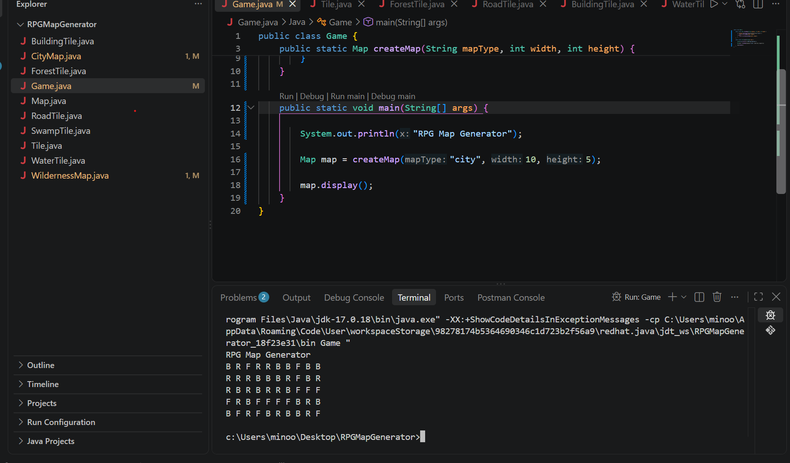
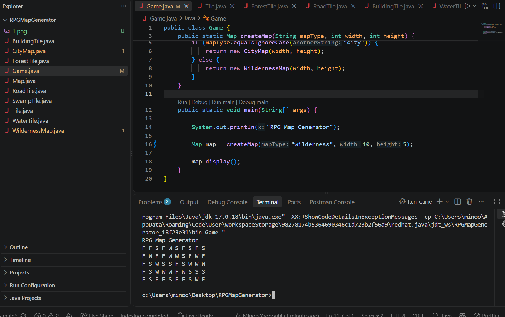

# RPG Map Generator

A simple Java project that generates random RPG maps using the Factory Method design pattern.

There are two types of maps:

* City Map
* Wilderness Map

The City Map contains road, forest and building tiles.

The Wilderness Map contains swamp, water and forest tiles.

## Tile Characters

* `R` = Road
* `F` = Forest
* `B` = Building
* `W` = Water
* `S` = Swamp

## City Map

Example of a randomly generated City Map:

## Wilderness Map

Example of a randomly generated Wilderness Map:

